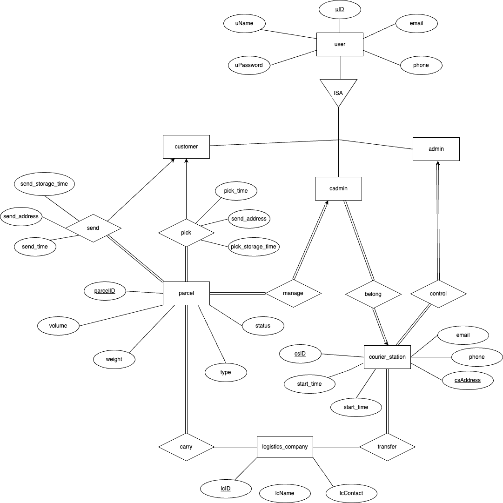
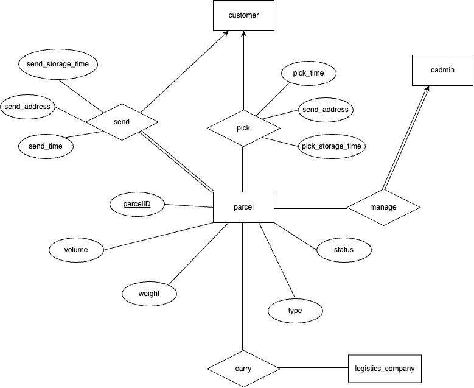
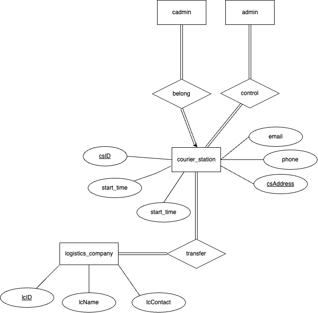
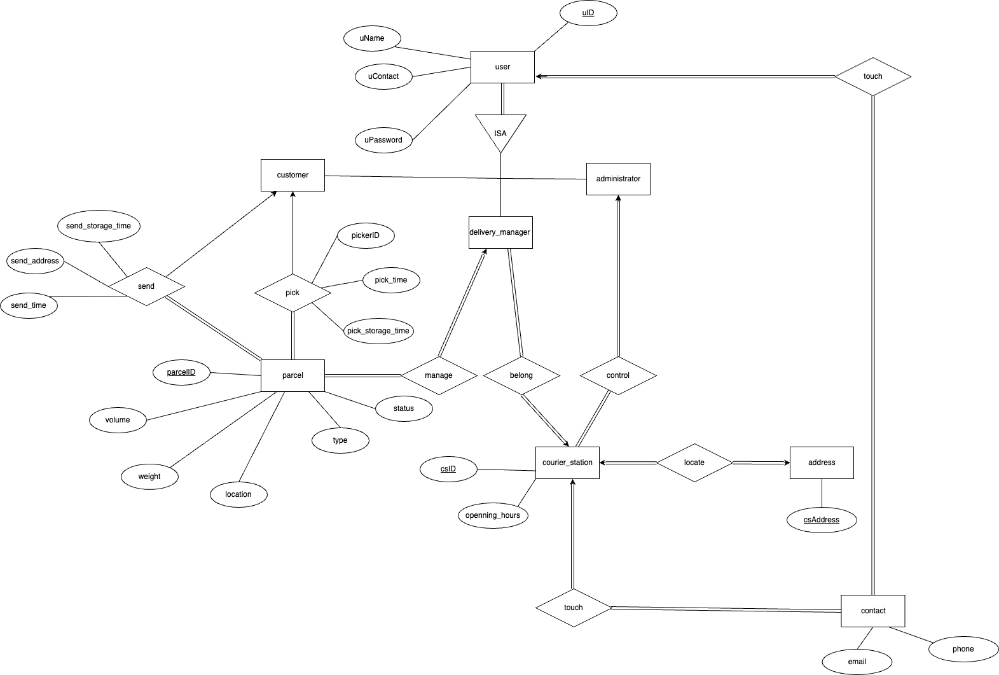

# Courier Station Information Management System

## Assumption

1. There is only one courier station in each region.
2. The address in this area is the address of the delivery station.
   - For example, there is a courier station on *XiangZhou,ZhuHai,GuangDong* then the address of this station will be *XiangZhou,ZhuHai,GuangDong*. There will be no additional specific address
3. One courier station may have many courier station manager.

## User Requirement

Since we have different kinds of users, I will describe user requirements by user.
### For the customer

1. **Pick Parcel**: Allows customers to pick a parcel from another customer.
2. **Send Parcel**: Allows customers to send a parcel to another customer.
3. **Parcel Tracking**: Allows customers to view the real-time location and status of their parcel during delivery.
4. **Personal Information Management**: Allow customers to update their personal information,  contact details.
5. **History**: Give customers the ability to view their order history.
6. **Shipping Options**: Choose from different delivery speeds and prices, such as standard, expedited, or timed delivery.
7. **Service Evaluation**: Provide a platform for customers to rate the express service and leave feedback.

### For the courier station manager

1. **Status Update**: Ability to update the delivery status of a package in the system, such as delivered or delayed.
2. **Courier Station Information Management**: Allow courier station manager to update their personal information, contact details, opening hours.
3. **History**: Allow courier station manager the ability to view information on packages that pass through this Courier station

### For the administrator

1. *Station status*: Ability to check the status of all of the courier station in this system.
2. **History**: Ability to view view all package information.

Here is a basic feature about the pick and send parcel.

CustomerA delivers the package to courier stationA and fills in the address that needs to be delivered, then the manager of courier stationA checks the package and transfers it to courier stationB according to the address, and the manager of courier stationB accepts the package. Finally, CustomerB can pick up the package.

## E-R Diagram

In the user part, the user uses uID to login, we use the ISA relationship to distinguish the user as customer, delivery manager and administrator, and this ISA relationship is not disjoint, which means that all users registered in the system can be more than one identity.

In the parcel section. Each parcel will be sent and picked up by one customer, each customer can send or pick up more than one parcel at the same time, and each parcel has its responsible delivery manager, and corresponding logistic company.

In the courier station section, we can see that each delivery manager belongs to a courier station, and the administrator of the system can control multiple courier stations. Every courier station has a specific location for the logistics company to transport the parcel to the fixed address.

Finall we can get the ER diagram like this.

## Logical Design

In our user requirement the 3 different kinds of users should be disjoint and total participation.

For the Entity part

we can get 3 relationship sets about the user according to the method in logical design.

- $customer$
- $courier\_adminstrator$*(courier_adminstrator)*
- $admin$*(adminstrator)*

And for each entity we can get one relationship set

- $parcel$
- $courier\_station$
- $logistics\_company$
- $address$
- $rating$

For the relationship part, we have 8 relationship in our system.

- $pick$  $\ Case IX$
- $send$  $\ Case IX$
- $manage$  $\ Case X$
- $belong$  $\ Case X$
- $control$ $\ Case X$
- $evaluate$ $\ Case VIII$

For above case we could not to create table.

- $carry$ $\ Case III$
- $transfer$ $\ Case III$

$admin=\{\underline{uID,uphone,umail},uname,upassword,ugender,upicture\}$
$cadmin=\{\underline{uID,uphone,umail},uname,upassword,ugender,upicture,csID\}$
$customer=\{\underline{uID,uphone,umail},uname,upassword,ugender,upicture\}$

$parcel=\{\underline{parcelID},volume,weight,status,parcelType,
          send\_address,pick\_address,send\_storage\_time,send\_time,pick\_storage\_time,
          pick\_time,cust\_send\_ID,cust\_pick\_ID,cadminID,\}$
$courier\_station=\{\underline{csID,phone,email,address},start\_time,end\_time,adminID\}$
$rating=\{\underline{ratingID},rating\_time,score,uID\}$
$logistics\_company=\{\underline{lsID,lsname,lsemail}\}$
$carry=\{\underline{lsID},parcelID\}$
$transfer=\{\underline{csaddress},lcID\}$

## Normalization

After the logical design the schemas in our database have already satisfed 1NF

Now let's continue to normalize the schema.

For these 3 user tables they have similar attributes

$admin=\{\underline{uID,phone,mail,}name,password,gender,picture\}$
$cadmin=\{\underline{uID,phone,mail},name,password,gender,picture,csID\}$
$customer=\{\underline{uID,phone,mail},name,password,gender,picture\}$

We can get the following function dependency.

$uID \rightarrow \{email,phone,name,password,gender,picture\}$

$email \rightarrow \{password,gender,picture\}$

$phone \rightarrow \{password,gender,picture\}$

$uID$ is obviously candicate key it can hold the whole schema.
While $email$ and $phone$ can hold the attribute $password,gender,picture$, respectively.

but email and phone are not superkey, therefore it violates BCNF.

so we do this decomposition to this schema.

Decomposition

$customer=\{\underline{uID},name,password,gender,picture\}$
$customer_phone=\{\underline{phone},uID\}$
$customer_mail=\{\underline{mail},uID\}$

$admin=\{\underline{uID}name,password,gender,picture\}$
$admin_phone=\{\underline{phone},uID\}$
$admin_mail=\{\underline{mail},uID\}$

$cadmin=\{\underline{uID},name,password,gender,picture,csID\}$
$cadmin_phone=\{\underline{phone},uID\}$
$cadmin_mail=\{\underline{mail},uID\}$

This obviously satisfies the BCNF.

For the Courier station schema it also has email and phone attribute, and there is one more property csaddress

$courier\_station=\{\underline{csID,phone,email,csaddress},start\_time,end\_time,adminID\}$
Functional dependency:
$csID\rightarrow \{start\_time,csaddress,phone,email,end\_time,adminID\}$
$phone\rightarrow \{start\_time,csaddress,csID,email,end\_time,adminID\}$
$email\rightarrow \{start\_time,csaddress,phone,csID,end\_time,adminID\}$
$csaddress\rightarrow \{start\_time,email,phone,csID,end\_time,adminID\}$

Therefore, we do decomposite just like before

$courier\_station=\{\underline{csID},start\_time,end\_time,adminID\}$
$csphone=\{\underline{phone},csID\}$
$csmail=\{\underline{email},csID\}$
$address=\{\underline{address},csID\}$

The next schema is about the parcel.

$parcel=\{parcelID,volume,weight,status,parcelType,
          send\_address,pick\_address,send\_storage\_time,send\_time,pick\_storage\_time,
          pick\_time,cust\_send\_ID,cust\_pick\_ID,cadminID\}$

We can get the following function dependency like this.

$parcelID \rightarrow \{volume,weight,status,parcelType,send\_address,pick\_address,send\_storage\_time,send\_time,pick\_storage\_time,
          pick\_time,cust\_send\_ID,cust\_pick\_ID,cadminID\}$

We can find it only has one functional dependency. And obviously, the parcelID is the condicate key in this schema. So it has been already satisfied BCNF.

$logistics\_company=\{\underline{lsID,lsname,lsemail}\}$

For the rest of the schema we can find it only has 2 attributes. So it must satisfy BCNF.

$address=\{\underline{address},csID\}$
$carry=\{\underline{lsID},parcelID\}$
$transfer=\{\underline{address},lcID\}$

## Bonus Part

### Use foreign keys

In this project, foreign keys are used in almost all the tables to establish connections.

### Use BLOB to store picture

In the table for each user, I used BLOB to save the profile picture。

### Use triggers to implement constraints

When dealing with the weight and volume of the package, I checked them on the front and back ends, especially on the back end, where I used triggers to make the volume and weight range from 0-300.

## Conclusion

In our project, customers can effortlessly pick and send packages, track deliveries in real-time, manage personal information, view order history, and evaluate the quality of service. Our system offers a range of dynamic shipping options to suit different customer preferences. For courier station managers, features such as status updates, site information management, and access to comprehensive historical logs can effectively manage packages. The ability to transfer parcels between sites ensures a smooth flow of parcels through the logistics network. In addition, administrators benefit from a centralized view of workstation status and a complete package history, allowing them to monitor and optimize overall system performance.
The ER diagram emphasizes the structural integrity of the system, depicting the relationship between the user, the package, and the courier station. Non-disjointed ISA relationships allow users to have multiple identities within the system, enhancing flexibility and user management.
Through the logical design obtained by the ER diagram, the database design of the express station information management system adopts standardized technology to eliminate redundancy, ensure data integrity, and optimize efficient queries.
In conclusion, the system is designed and functioned to enhance the overall courier service experience for both customers and warehouse managers.
